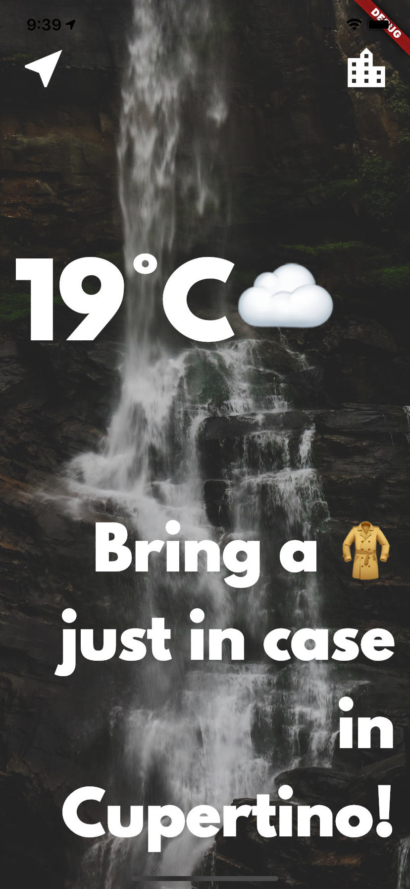

# Clima ☁

A simple weather app inspired by the beautiful designs made by [Olia Gozha](https://dribbble.com/shots/4663154-).

The objective of this study project is to learn about asynchronous programming in Dart.

## Library Used

- Material
- Convert
- Geolocator
- Flutter SpinKit
- HTTP

## What I learned so far:
- How to use Dart to perform asynchronous tasks (async/await, futures).
- How to network with the Dart http package and to parse JSONs using the Dart convert package.
- How to pass data forwards and backwards between screens using the Navigator.
- Learn about the lifecycle of Stateful Widgets and how to override them.
- How to use the Geolocator package to get live location data for both iOS and Android.

## Issues

Feel free to submit issues and enhancement requests.

## Contributing

Please refer to each project's style guidelines and guidelines for submitting patches and additions. In general, we follow the "fork-and-pull" Git workflow.

 1. **Fork** the repo on GitHub
 2. **Clone** the project to your own machine
 3. **Commit** changes to your own branch
 4. **Push** your work back up to your fork
 5. Submit a **Pull request** so that we can review your changes

## License

    Copyright 2020 Piotr Ekert

    Licensed under the Apache License, Version 2.0 (the "License");
    you may not use this file except in compliance with the License.
    You may obtain a copy of the License at

       http://www.apache.org/licenses/LICENSE-2.0

    Unless required by applicable law or agreed to in writing, software
    distributed under the License is distributed on an "AS IS" BASIS,
    WITHOUT WARRANTIES OR CONDITIONS OF ANY KIND, either express or implied.
    See the License for the specific language governing permissions and
    limitations under the License.

