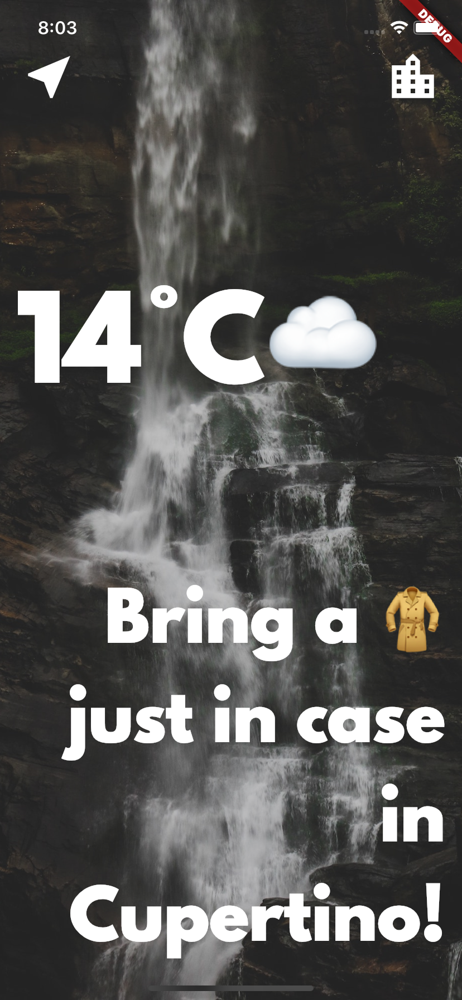

# climaweatherapp

    

# Clima ☁

A simple weather app inspired by the beautiful designs made by [Olia Gozha](https://dribbble.com/shots/4663154-).

The objective of this study project is to learn about asynchronous programming in Dart.

### Library Used

- Material
- Convert
- Geolocator
- Flutter SpinKit
- HTTP

### What I learned so far:
- How to use Dart to perform asynchronous tasks (async/await, futures).
- How to network with the Dart http package and to parse JSONs using the Dart convert package.
- How to pass data forwards and backwards between screens using the Navigator.
- Learn about the lifecycle of Stateful Widgets and how to override them.
- How to use the Geolocator package to get live location data for both iOS and Android.
